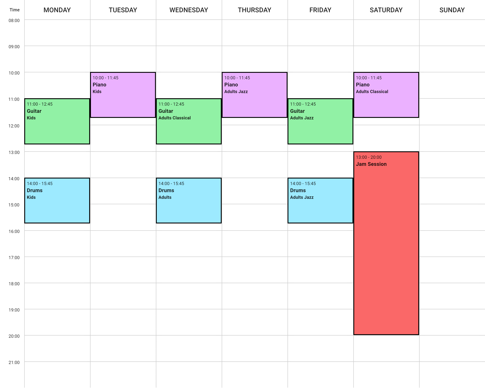

# weekly-timetable-generator


A simple react web app to generate (decent) weekly timetables. Only client side.

Demo [here](https://simple-timetable-generator.web.app/)



The initial skeleton was created by ChatGPT. Unfortunately, it doesn't really know the latest versions of MUI, so it needed some manual refinement.

## Get started

Dev

`
npm rur dev
`

Build (output to `public` folder)

`
npm run build
`

## Timetable

> [!WARNING]
>  
> - **Overlapping** classes are not hadled yet.
> - Currently there is no validation on the input (e.g., endTime after startTime)
> - Currently, the timetable is built with basic HTML  `<table>`.

The timetable can be created manually or by importing a JSON file representing the courses like the example below. The idea is that courses can have multiple classes, and each class can have an additional (optional) label, e.g.:

- Course name: Piano
  - Class label: Classical
  - Class label: Jazz
- Course name: Jam Session
  - Class label: *(empty)*

The JSON version would be:

```json
[
    {
        "name": "Piano",
        "color": "#FF4D4D",
        "schedule": [
            {
                "dayOfWeek": "Tuesday",
                "timeFrom": "10:00",
                "timeTo": "11:30",
                "label": "Classical"
            },
            {
                "dayOfWeek": "Thursday",
                "timeFrom": "10:00",
                "timeTo": "11:30",
                "label": "Jazz"
            }
        ]
    },
    { 
        "name": "Jam Session",
        "color": "#91F1A5",
        "schedule": [
            {
                "dayOfWeek": "Saturday",
                "timeFrom": "9:00",
                "timeTo": "12:00",
                "label": ""
            },
            {
                "dayOfWeek": "Wednesday",
                "timeFrom": "14:00",
                "timeTo": "19:00",
                "label": ""
            }
        ]
    }
]
```

## Github/Firebase CICD

The project is linked to Firebase. The CD has been set up with the Firebase CLI. You might want to adjust the project name in the .firebaserc file. Automatic deployment is handled via two GitHub actions, one for a normal merge and one for a PR. The following variables are needed:

- `secrets.GITHUB_TOKEN`
- `secrets.FIREBASE_SERVICE_ACCOUNT_SIMPLE_TIMETABLE_GENERATOR`